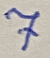
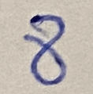
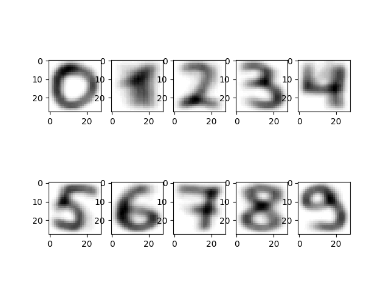

# Simple digit recognition algorithm

## Installation

```bash
$ git clone https://github.com/harmakit/digit-recognition.git
$ cd digit-recognition
$ pip install -r requirements.txt
```

## Run

```bash
$ python main.py
```

## Algorithm

### Step 1. Create digit models
**If MNIST dataset is used**    
- Load data from dataset

**If data from images is used**
- Load images with digits from "data/orig" directory
- Preprocess images:
- - Convert to grayscale
- - Binarize
- - Apply Gaussian filter
- - Resize to 28x28
- - Apply opening to remove noise
- - Save to "data/converted" directory
- Save processed pixels data to "data/npy" directory




### Step 2. Combine pixel data from all images
I implemented this step in two ways:

**Cumulative sum of all pixels**  
- Stating with the first image, for each pixel, add the value of the pixel to the value of the same pixel in the next image.  
- Then divide by 2. 
- Repeat this process until all images are processed.


**Avg sum of all pixels**  
- Sum all pixels from all images and divide by number of images.

> note: This algorithm cannot be chosen from menu. If you want to try this algorithm, pass DataProviderAlgorithm.AVG as a second argument to DataProvider constructor




### Step 3. Recognize digit

- Load image to recognize from "digit.png" in project root
- Preprocess image
- Find the difference between the image to recognize and each digit in model


## Example

Guessing digit from image


```bash
$ python3 main.py
Choose action                                                                                                                                                                                             
> [r] run recognizer                                                                                                                                                                                      
  [t] test recognizer                                                                                                                                                                                     
  [u] update data from images   
  
Choose data source                                                                                                                                                                                        
> [d] data dir                                                                                                                                                                                            
  [m] mnist dataset  
  
Guessed digit: 7 with confidence: 91.88352147499624
```

Updating data models from images in "data/orig" directory

```bash
Choose action                                                                                                                                                                                             
  [r] run recognizer                                                                                                                                                                                      
  [t] test recognizer                                                                                                                                                                                     
> [u] update data from images    

Updated digit 0 with 10 images
Updated digit 1 with 10 images
Updated digit 2 with 10 images
Updated digit 3 with 10 images
Updated digit 4 with 10 images
Updated digit 5 with 10 images
Updated digit 6 with 10 images
Updated digit 7 with 10 images
Updated digit 8 with 10 images
Updated digit 9 with 10 images
Updated data
```

Running tests (randomly chosen digit from model to be recognized at each iteration)

```bash

```bash
Choose action                                                                                                                                                                                             
  [r] run recognizer                                                                                                                                                                                      
> [t] test recognizer                                                                                                                                                                                     
  [u] update data from images  

Choose data source                                                                                                                                                                                        
> [d] data dir                                                                                                                                                                                            
  [m] mnist dataset        

Guessed 712 out of 1000 digits correctly. Accuracy: 71.2%
```